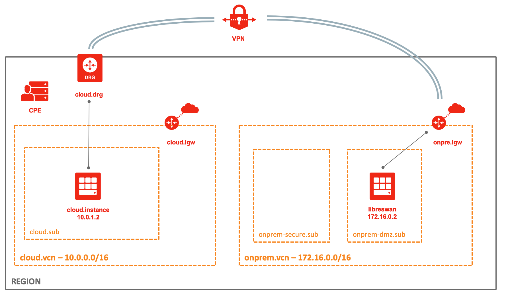

# OCI - VPN Lab

Terraform script to setup a VPN lab on OCI.
It creates a fully functional 2-tunnels IPSec VPN between OCI VPN Service (cloud) and libreswan based compute instance (onprem).




## Setup 

Create env-vars file 

```shell
cp env-vars_template env-vars
```

Edit env-vars, replacing _\_\_placeholders\_\__ with your configuration values 

```shell
. env-vars
terraform init
terraform plan
terraform apply
```